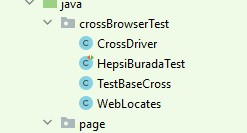
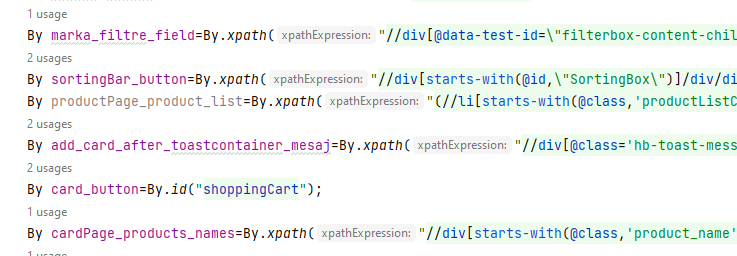
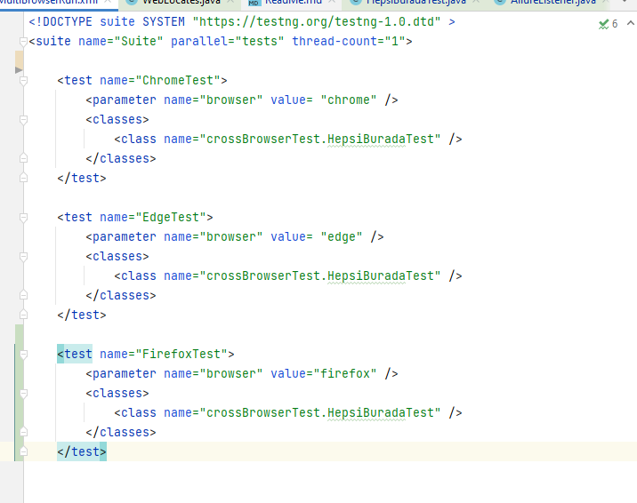

# INTERVIEW QUESTIONS Test Case Çalışması
## Hepsiburada Sitesi Üzerinde Yaptığımız Kullanıcı Testi

 Hepsiburada sitesi üzerinde yaptıgımız bu test çalışmasında aşagıdaki senaryo üzerinde çalışıldı.

        anasayfa_ac("Hepsiburada");
        anasayfa_acildiginin_dogrulamasi();
        urun_sec("Elektronik","Bilgisayar/Tablet","Notebook");
        urun_secimi_dogrulamasi("Notebook");
        marka_filitrelemesi_yap("Apple");
        liste_siralamasi_yapma("Çok satanlar");
        urun_sec(2);
        sepete_uruneklenmesi_dogrulamasi();
        sepet_sayfasini_ac();
        sepet_sayfasinda_urun_dogrulamasi();
        alisverisi_tamamla_button_click();
        login_ekrani_dogrulamasi();
        browser_penceresini_kapat();

- Aynı test senaryosu farklı browserlarda da çalışması için framework de kullanılan driver class'ı tekrar modifiye edilerek 
framework içinde farklı class içinde kullanıldı. 

- 
- Test steplerinde de görüldüğü gibi secim işlemlerini dinamik yapabilme adına metot dizaynları buna göre yapıldı.
- Kullanılan *kategori secimi, filitreleme ve sıralama işlemleri* istenildiğinde değiştirilebilecek şekilde dinamik olarak tasarlandı.
- Framework içinde page sayfaları özellikle **Selenium 4** den sonra öne çıkan **By Metot** yapısı ile oluşturuldu.

### Raporlama
Raporlama da Allure Report Kullanıldı. Raporlamalara Ulaşmak için Testler Çalıştırıldıkdan Sonra Proje İçinde oluşan **allure-result**
klasörünün path'i ni alıp konsolda aşağıdaki gibi yazıp çalıştırmamız gereklidir.

### Rapor ile İlgili Görseller
- Komut Default Browserımızda **allure-result** Klasörü İçersine Kayıt Edilen json Uzantılı Dosyaları Bir Araya Getirerek
  Rapor Formantında Bize Gösteriyor.
  
- 
  

- Rapor içinde kullanılan parametrelerinde görülmesi için rapor formatında gerekli olan modifikasyonlar yapıldı.

### Multibrowser ile Testleri Çoklu Browserlarda Çalıştırma
- Testcase de istenildiği gibi testlerin **Firefox, Chrome ve Edge** de çalıştırılması için 
Xml dosyası hazırlandı burada testler paralel ve sıralı çalışması adına **muti-thread** secenegi 1 olarak seçildi.

### Testler Hazırlanırken

> - Proje **Java** Programlama Dilinde Yazılmıştır.
> - Yazılan Senaryolar da Web de **Selenium** ve **TestNG** Framework'ü Kullanılmıştır.
> - Framework Yapısı **Page Object Model(POM)** ile Dizayn Edilmiştir.
> - Framework Yapısı İçerisinde Yapılan Kodlamalar da **Object Oriented Programming(OOP)** Kullanılmıştır.
> - Proje de Her İki Test Senaryosunda da  Locate'ler **By Metod**'la Alınmış _Findby Anotation_'ı Kullanılmamıştır.
> - Raporlama Tool'u Olarak **Allure Report** Kullanılmıştır.
> - Her Aşamada **Assertion**'lar la Testin Akışı İle İlgili Doğrulamalar Yapılmıştır.
> - Testlerde Kullanılan Data'lar **Properties** Classı Kullanılarak Alınmıştır.

